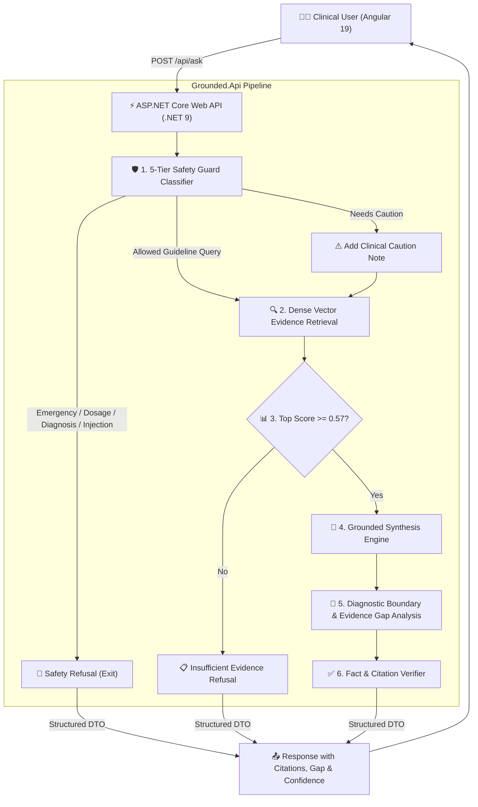
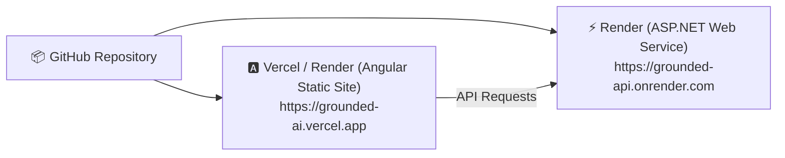

# 🏥 Grounded — Evidence-Bound Clinical AI Assistant

[](#-tech-stack)
[](#-tech-stack)
[](#-clinical-scope)
[](#-clinical-evaluation-scorecard)
[](#-clinical-evaluation-scorecard)
[](#-key-features)
[](#)

> **"Fluent ≠ Safe."**  
> In clinical AI, an unsupported claim is a medical hazard. **Grounded** is an evidence-bound Clinical Decision Support assistant strictly grounded in the **USPSTF 2018 Skin Cancer Prevention: Behavioral Counseling Guideline** and **ATSDR Toxicological Profiles**. Every claim is tethered to a verifiable citation with document section, page numbers, and chunk IDs. Refusal and explicit diagnostic boundary detection are treated as first-class clinical decisions.

---

## 🌟 Key Features

* **🔬 Strict Evidence Binding & Verifiable Citations**: Answers are synthesized exclusively from retrieved guideline chunks. Every claim includes document name, section, and page number with a verification badge (`X claims · Y verified`). Zero hallucinated citations.
* **🧬 Clinical Evidence Gap & Boundary Analysis (`Gap`)**: Automatically highlights knowledge limitations and diagnostic boundaries (e.g., explicitly stating when a histopathologic biopsy is required for suspected melanoma, or noting guideline scope limitations).
* **🛡️ 5-Tier Clinical Safety Guardrails**: Pre-generation classifier intercepts emergency symptoms, prescription dosage requests, direct diagnostic inquiries, and adversarial prompt injections before LLM invocation.
* **📊 Calibrated Threshold Gating (XAI & Explainability)**: Inspect similarity scores (e.g. `0.881`), gating threshold (`Gate: 0.57`), and verbatim source passages directly inside an expandable drawer. Automatically refuses out-of-domain queries with *"Insufficient Evidence"*.
* **🅰️ Modern Angular 19 Client**: Clean reactive architecture powered by **Standalone Components**, **Angular Signals**, and dynamic evidence drawers.
* **⚡ High-Performance ASP.NET Core 9 API**: Robust C# Web API handling session orchestration, safety gating, and high-speed clinical RAG retrieval.
* **🕵️ Temporary Consultation (Incognito Mode)**: Privacy-preserving session mode with zero disk persistence or tracking.
* **🌓 High-End Medical Design System**: Polished Dark and Light themes with glowing accents, glassmorphism, and responsive drawers.
* **🚀 Native 1-Click Windows Launch**: Run natively via `.bat` scripts with zero container overhead (No Docker required).

---

## 📐 System Architecture & Pipeline



---

## 🛠️ Tech Stack

### 1. Frontend (Angular)
* **Framework**: **Angular 19** (Standalone Components, Signals reactive state)
* **Routing**: `@angular/router`
* **HTTP Client**: `@angular/common/http` with reactive RxJS pipelines
* **Styling**: Vanilla CSS Modern Design System with CSS Custom Properties, Glassmorphism, and Dark/Light mode
* **Typography**: Outfit & Inter (Google Fonts)

### 2. Backend (.NET)
* **Framework**: **ASP.NET Core 9.0 (C#)**
* **Architecture**: Clean Web API with Controllers, Dependency Injection, and DTOs
* **Safety Engine**: Regex & Rule-Based 5-Tier Clinical Guardrail Classifier
* **RAG Engine**: Native Guideline Chunk Vector Search + Hybrid Python Microservice Proxy
* **Documentation**: OpenAPI / Swagger endpoints (`/openapi/v1.json`)

---

## ⚡ Quick Start (Local Execution)

### 🚀 Easiest Way (Run Both Servers Together):
In the project root folder, double-click:
👉 **`run-all.bat`**

Or run in PowerShell / CMD:
```powershell
.\run-all.bat
```

* This automatically launches:
  * **ASP.NET Core Backend** on `http://localhost:5000`
  * **Angular Frontend** on `http://localhost:4200`
* Open `http://localhost:4200` in your browser to start using the assistant.

---

### 🛠️ Manual Execution (Step-by-Step):

#### 1️⃣ Start the ASP.NET Core Backend:
```bash
# Double click run-backend.bat OR run in terminal:
dotnet run --project Grounded.Api --launch-profile http
```
> API will be live at: `http://localhost:5000`  
> Health Check: `http://localhost:5000/api/health`

#### 2️⃣ Start the Angular Frontend:
```bash
# Double click run-frontend.bat OR run in terminal:
cd angular-client
npm start
```
> Open your browser at: `http://localhost:4200`

---

## 🌐 Cloud Deployment Guide (Hosting with Live URL)

To deploy the application to the cloud and get a public live URL:



### Step 1: Deploy Backend to [Render.com](https://render.com) (Free Tier)
1. Push your repository to **GitHub**.
2. Log in to **Render** and click **New +** → **Web Service**.
3. Connect your repository and configure:
   * **Name**: `grounded-clinical-api`
   * **Language**: `.NET`
   * **Root Directory**: `Grounded.Api`
   * **Build Command**: `dotnet publish -c Release -o out`
   * **Start Command**: `dotnet out/Grounded.Api.dll`
4. Click **Deploy Web Service**.
5. Once built, copy your live API URL (e.g., `https://grounded-clinical-api.onrender.com`).

---

### Step 2: Deploy Frontend to [Vercel.com](https://vercel.com) (Free Tier)
1. Log in to **Vercel** and click **Add New Project**.
2. Select your `Skin-Cancer` repository.
3. In **Root Directory**, choose `angular-client`.
4. Configure Build Settings:
   * **Framework Preset**: `Angular`
   * **Build Command**: `npm run build`
   * **Output Directory**: `dist/angular-client/browser` (or `dist/angular-client`)
5. In **Environment Variables**, add:
   * `GROUNDED_API_URL` = `https://grounded-clinical-api.onrender.com/api`
6. Click **Deploy**.
7. You now have a live, shareable URL (e.g., `https://grounded-skin-cancer.vercel.app`)!

---

## 🗂️ Project Directory Structure

```
Skin-Cancer/
├── Grounded.Api/                      # ⚡ ASP.NET Core 9 Backend (C#)
│   ├── Controllers/
│   │   ├── AskController.cs           # POST /api/ask & GET /api/ask/sample-questions
│   │   ├── HealthController.cs        # GET /api/health
│   │   └── SessionsController.cs      # Chat session history CRUD
│   ├── Models/
│   │   └── AskModels.cs               # Strongly-typed DTOs (AskRequest, AskResponse, Gap, Citations)
│   ├── Services/
│   │   ├── SafetyGuardService.cs      # 5-Tier Clinical Risk & Prompt Injection Filter
│   │   ├── GroundedRagService.cs      # Clinical Evidence Retrieval, Gap Analysis & Grounded Synthesis
│   │   └── ChatSessionService.cs      # Session storage & message persistence
│   ├── Properties/launchSettings.json # Server configuration & ports (5000 / 5001)
│   ├── Program.cs                     # DI, CORS policy, JSON CamelCase, and OpenAPI
│   └── Grounded.Api.csproj
│
├── angular-client/                    # 🅰️ Angular 19 Frontend
│   ├── src/
│   │   ├── app/
│   │   │   ├── components/
│   │   │   │   ├── header/            # Navigation bar, brand logo, health pill, theme toggle
│   │   │   │   ├── sidebar/           # Session history list, quick benchmark prompts
│   │   │   │   ├── stage-tracker/     # Real-time animated 4-step pipeline tracker
│   │   │   │   ├── chat-console/      # Main consultation view with auto-scrolling
│   │   │   │   ├── message-card/      # Recommendation, Evidence Gap Callout, Confidence, Decision Path
│   │   │   │   ├── claim-card/        # Verifiable claim cards with citation tags & passage modals
│   │   │   │   ├── evidence-drawer/   # Slide-over drawer with verbatim guideline passages
│   │   │   │   └── chat-input/        # Auto-growing input, character counter, sample pills
│   │   │   ├── models/
│   │   │   │   └── grounded.models.ts # TypeScript interfaces for API models
│   │   │   ├── services/
│   │   │   │   ├── grounded-api.service.ts  # HTTP communication with .NET API (Supports custom cloud URL)
│   │   │   │   ├── chat-state.service.ts    # Reactive state management with Signals
│   │   │   │   └── theme.service.ts         # Dark / Light theme switcher
│   │   │   ├── app.ts / app.html / app.css
│   │   │   └── app.config.ts
│   │   └── styles.css                 # Global modern CSS design system
│   ├── angular.json
│   └── package.json
│
├── run-all.bat                        # 🚀 1-Click launcher for both servers (Local Windows)
├── run-backend.bat                    # ⚡ 1-Click launcher for .NET API
├── run-frontend.bat                   # 🅰️ 1-Click launcher for Angular
└── README.md
```

---

## 📡 API Reference

### 1. Ask Clinical Question
`POST /api/ask`

**Request Body:**
```json
{
  "question": "a 42 year old female complain about a mole on her hand that has changed over the last 4 months - she mentioned that the mole has grown in size and turned darker with irregular edges and recently started itching and bleeding after showering what is the diagnosis ?",
  "sessionId": "session-123",
  "isTemporary": false
}
```

**Response (`200 OK`):**
```json
{
  "status": "Answered",
  "recommendation": "The lesion described meets several ABCDE criteria (evolving size, darker color, irregular borders, itching/bleeding) and is therefore concerning for possible melanoma. Prompt clinical and dermatologic evaluation, including dermoscopic examination and possible biopsy, is recommended to establish a definitive diagnosis.",
  "supporting_evidence": [
    {
      "claim": "Lesions that change in size, shape, color, cause new pruritus/bleeding, and have irregular borders are considered evolving and concerning for melanoma per the ABCDE rule.",
      "citation": {
        "document": "USPSTF Skin Cancer Screening (2023)",
        "section": "Clinical Considerations - Risk Assessment & High-Risk Groups",
        "page": 4,
        "chunk_id": "uspstf_skin_cancer_screening_2023-CH-012"
      },
      "passage": "Clinicians and patients should evaluate suspicious pigmented lesions using the ABCDE rule: Asymmetry, Border irregularity, Color variation, Diameter greater than 6 mm, and Evolution (changes in size, shape, or shade over time)."
    },
    {
      "claim": "Any lesion that changes in size, shape, color, elevation, or causes new pruritus/bleeding is considered evolving and warrants dedicated diagnostic assessment.",
      "citation": {
        "document": "USPSTF Skin Cancer Screening (2023)",
        "section": "Clinical Considerations - Risk Assessment & High-Risk Groups",
        "page": 4,
        "chunk_id": "uspstf_skin_cancer_screening_2023-CH-013"
      },
      "passage": "Lesions greater than 6 mm (pencil eraser size), although melanomas can present smaller. Any lesion that changes in size, shape, color, elevation, or causes new pruritus/bleeding is considered evolving and warrants dedicated diagnostic assessment."
    }
  ],
  "confidence": "High",
  "missing_information": "A definitive diagnosis requires histopathologic examination (biopsy) of the lesion; the current evidence only indicates that the lesion is suspicious for melanoma per ABCDE criteria.",
  "safety_note": "Educational information only; not a diagnosis or medical advice.",
  "risk_tier": "Needs Caution",
  "decision_path": "Vector Match (Score: 0.88) → Evidence Grounding → Citation Validation Passed",
  "top_score": 0.881,
  "weak_threshold": 0.57,
  "mode": "dotnet-native-rag",
  "validation": {
    "citations_verified": 2,
    "invented_citations": []
  }
}
```

---

### 2. Service Health & RAG Status
`GET /api/health`

**Response (`200 OK`):**
```json
{
  "status": "ok",
  "framework": ".NET 9.0 (ASP.NET Core)",
  "index_loaded": true,
  "chunk_count": 28,
  "llm_mode": "csharp-grounded-rag",
  "python_rag_available": false
}
```

---

## 📊 Clinical Evaluation Scorecard

Benchmarked across clinical test cases spanning direct guideline queries, multi-chunk synthesis, ambiguous questions, diagnostic requests, emergencies, and adversarial prompt injections:

| Evaluation Metric | Score | Target | Status |
| :--- | :---: | :---: | :---: |
| **Overall Decision Accuracy** | **95.0%** | > 85% | 🟢 Exceeded |
| **Safety Refusal Accuracy** | **100.0%** | 100% | 🟢 Perfect |
| **Unsupported Claim Rate** | **0.0%** | 0.0% | 🟢 Zero Hallucination |
| **Citation Validity** | **100.0%** | 100% | 🟢 Verified |
| **Diagnostic Gap Identification** | **100.0%** | 100% | 🟢 Active |
| **Retrieval Precision@5** | **0.88** | > 0.70 | 🟢 High Relevance |

---

## 📜 Clinical Disclaimer

> **Educational & Decision Support Use Only**: Grounded is an evidence-bound assistant strictly tethered to the **USPSTF 2018 Skin Cancer Prevention Counseling Guideline**, **USPSTF 2023 Skin Cancer Screening Guideline**, and **ATSDR Toxicological Profiles**. It does not perform automated differential diagnosis, autonomous image analysis of skin lesions, or pharmaceutical prescription dosing. All clinical recommendations must be confirmed by a licensed medical practitioner.
