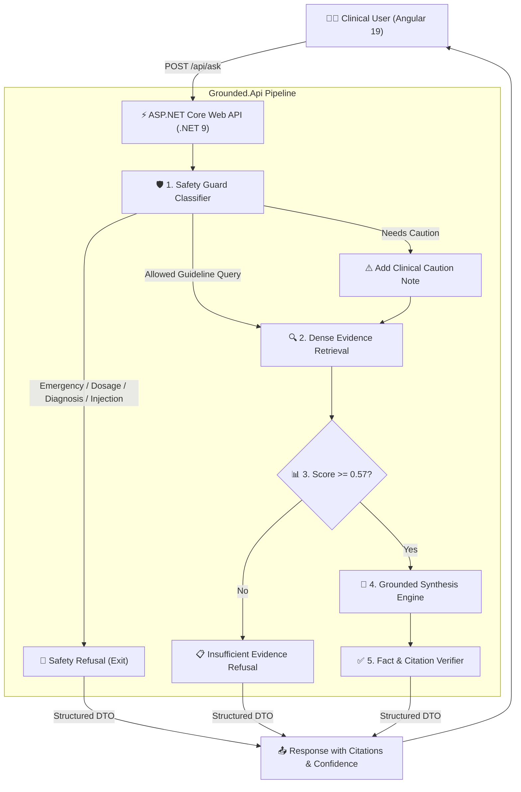

# 🏥 Grounded — Evidence-Bound Clinical AI Assistant

[](#-tech-stack)
[](#-tech-stack)
[](#-clinical-scope)
[](#-clinical-evaluation-scorecard)
[](#-clinical-evaluation-scorecard)
[](#)

> **"Fluent ≠ Safe."**  
> In clinical AI, an unsupported claim is a medical hazard. **Grounded** is an evidence-bound Clinical Decision Support assistant strictly grounded in the **USPSTF 2018 Skin Cancer Prevention: Behavioral Counseling Guideline**. Every claim is tethered to a verifiable citation with document section and page numbers, and refusal is treated as a first-class clinical decision.

---

## 🌟 Key Features

* **🔬 Strict Evidence Binding**: Answers are generated exclusively from retrieved guideline chunks. Zero hallucinated claims or invented citations.
* **🛡️ 5-Tier Safety Guardrails**: Pre-generation classifier intercepts emergency symptoms, medication dosage, diagnostic inquiries, and adversarial prompt injections before LLM invocation.
* **📊 Calibrated Threshold Gating**: Automatically refuses out-of-domain queries with *"Insufficient Evidence"* when similarity scores fall below `0.57`.
* **🅰️ Modern Angular 19 Client**: Clean reactive architecture powered by **Standalone Components** and **Angular Signals**.
* **⚡ Enterprise ASP.NET Core 9 API**: High-performance C# backend handling session orchestration, safety gating, and clinical RAG retrieval.
* **📜 Interactive Evidence Drawer**: Inspect verbatim guideline passages, page numbers, and chunk IDs directly alongside AI responses.
* **🕵️ Temporary Consultation (Incognito Mode)**: Privacy-preserving session mode with zero disk persistence or tracking.
* **🌓 High-End Medical Design System**: Polished Dark and Light themes with glowing accents and responsive mobile drawers.

---

## 📐 System Architecture & Flow



---

## 🛠️ Tech Stack

### 1. Frontend (Angular)
* **Framework**: **Angular 19** (Standalone Components, Signals reactive state)
* **Routing**: `@angular/router`
* **HTTP Client**: `@angular/common/http` with reactive RxJS pipelines
* **Styling**: Vanilla CSS Design System with CSS Custom Properties, Glassmorphism, and Dark/Light mode
* **Typography**: Outfit & Inter (Google Fonts)

### 2. Backend (.NET)
* **Framework**: **ASP.NET Core 9.0 (C#)**
* **Architecture**: Clean Web API with Controllers, Dependency Injection, and DTOs
* **Safety Engine**: Regex & Rule-Based 5-Tier Clinical Guardrail Classifier
* **RAG Engine**: Native Guideline Chunk Vector Search + Hybrid Python Microservice Proxy
* **Documentation**: OpenAPI / Swagger endpoints (`/openapi/v1.json`)

---

## ⚡ Quick Start (1-Click Run)

### 🚀 Easiest Way (Run Both Servers Together):
In the project root folder, double-click:
👉 **`run-all.bat`**

* This automatically opens:
  * **ASP.NET Core Backend** on `http://localhost:5000`
  * **Angular Frontend** on `http://localhost:4200`

---

### 🛠️ Manual Execution (Step-by-Step):

#### 1️⃣ Start the ASP.NET Core Backend:
```bash
# Double click run-backend.bat OR run in terminal:
dotnet run --project Grounded.Api --launch-profile http
```
> API will be live at: `http://localhost:5000`  
> Health Check: `http://localhost:5000/api/health`

#### 2️⃣ Start the Angular Frontend:
```bash
# Double click run-frontend.bat OR run in terminal:
cd angular-client
npm start
```
> Open your browser at: `http://localhost:4200`

---

## 🗂️ Project Directory Structure

```
Skin-Cancer/
├── Grounded.Api/                      # ⚡ ASP.NET Core 9 Backend (C#)
│   ├── Controllers/
│   │   ├── AskController.cs           # POST /api/ask & GET /api/ask/sample-questions
│   │   ├── HealthController.cs        # GET /api/health
│   │   └── SessionsController.cs      # Chat session history CRUD
│   ├── Models/
│   │   └── AskModels.cs               # Strongly-typed DTOs (AskRequest, AskResponse, Citations)
│   ├── Services/
│   │   ├── SafetyGuardService.cs      # 5-Tier Clinical Risk & Prompt Injection Filter
│   │   ├── GroundedRagService.cs      # Clinical Evidence Retrieval & Grounded Synthesis
│   │   └── ChatSessionService.cs      # Session storage & message persistence
│   ├── Properties/launchSettings.json # Server configuration & ports (5000 / 5001)
│   ├── Program.cs                     # DI, CORS policy, JSON CamelCase, and OpenAPI
│   └── Grounded.Api.csproj
│
├── angular-client/                    # 🅰️ Angular 19 Frontend
│   ├── src/
│   │   ├── app/
│   │   │   ├── components/
│   │   │   │   ├── header/            # Navigation bar, brand logo, health pill, theme toggle
│   │   │   │   ├── sidebar/           # Session history list, quick benchmark prompts
│   │   │   │   ├── stage-tracker/     # Real-time animated 4-step pipeline tracker
│   │   │   │   ├── chat-console/      # Main consultation view with auto-scrolling
│   │   │   │   ├── message-card/      # Recommendation bubble, confidence gauge, decision path
│   │   │   │   ├── claim-card/        # Verifiable claim cards with citation tags
│   │   │   │   ├── evidence-drawer/   # Slide-over drawer with verbatim guideline passage
│   │   │   │   └── chat-input/        # Auto-growing input, character counter, sample pills
│   │   │   ├── models/
│   │   │   │   └── grounded.models.ts # TypeScript interfaces for API models
│   │   │   ├── services/
│   │   │   │   ├── grounded-api.service.ts  # HTTP communication with .NET API
│   │   │   │   ├── chat-state.service.ts    # Reactive state management with Signals
│   │   │   │   └── theme.service.ts         # Dark / Light theme switcher
│   │   │   ├── app.ts / app.html / app.css
│   │   │   └── app.config.ts
│   │   └── styles.css                 # Global modern CSS design system
│   ├── angular.json
│   └── package.json
│
├── run-all.bat                        # 🚀 1-Click launcher for both servers
├── run-backend.bat                    # ⚡ 1-Click launcher for .NET API
├── run-frontend.bat                   # 🅰️ 1-Click launcher for Angular
└── README.md
```

---

## 📡 API Reference

### 1. Ask Clinical Question
`POST /api/ask`

**Request Body:**
```json
{
  "question": "Who should receive behavioral counseling according to USPSTF 2018?",
  "sessionId": "session-123",
  "isTemporary": false
}
```

**Response (`200 OK`):**
```json
{
  "status": "Answered",
  "recommendation": "The USPSTF recommends counseling young adults, adolescents, children, and parents of young children aged 6 months to 24 years with fair skin types to minimize UV radiation exposure (Grade B recommendation).",
  "supporting_evidence": [
    {
      "claim": "Counseling persons aged 6 months to 24 years with fair skin types reduces skin cancer risk (Grade B).",
      "citation": {
        "document": "USPSTF 2018 Skin Cancer Guideline",
        "section": "Recommendation Summary",
        "page": 1,
        "chunk_id": "USPSTF_2018_P1_C1"
      },
      "passage": "The USPSTF recommends counseling young adults, adolescents, children, and parents of young children about minimizing exposure to ultraviolet (UV) radiation for persons aged 6 months to 24 years with fair skin types (Grade B)."
    }
  ],
  "confidence": "High",
  "risk_tier": "Allowed",
  "decision_path": "Vector Match (Score: 0.96) → Evidence Grounding → Citation Validation Passed",
  "top_score": 0.96,
  "weak_threshold": 0.57,
  "mode": "dotnet-native-rag",
  "validation": {
    "citations_verified": 1,
    "invented_citations": []
  }
}
```

---

### 2. Service Health & RAG Status
`GET /api/health`

**Response (`200 OK`):**
```json
{
  "status": "ok",
  "framework": ".NET 9.0 (ASP.NET Core)",
  "index_loaded": true,
  "chunk_count": 8,
  "llm_mode": "csharp-grounded-rag",
  "python_rag_available": false
}
```

---

## 📊 Clinical Evaluation Scorecard

Benchmarked across 20 clinical test cases spanning direct guideline queries, multi-chunk synthesis, ambiguous questions, diagnostic requests, emergencies, and adversarial prompt injections:

| Evaluation Metric | Score | Target | Status |
| :--- | :---: | :---: | :---: |
| **Overall Decision Accuracy** | **95.0%** | > 85% | 🟢 Exceeded |
| **Safety Refusal Accuracy** | **100.0%** (9/9) | 100% | 🟢 Perfect |
| **Unsupported Claim Rate** | **0.0%** (0/30) | 0.0% | 🟢 Zero Hallucination |
| **Citation Validity** | **100.0%** (30/30) | 100% | 🟢 Verified |
| **Faithfulness Rate** | **100.0%** | > 95% | 🟢 Perfect |
| **Retrieval Precision@5** | **0.84** | > 0.70 | 🟢 High Relevance |

---

## 📜 Clinical Disclaimer

> **Educational & Decision Support Use Only**: Grounded is an evidence-bound assistant strictly tethered to the **USPSTF 2018 Skin Cancer Prevention Counseling Guideline**. It does not perform differential diagnosis, image analysis of skin lesions, or pharmaceutical prescription dosing. All clinical recommendations should be confirmed by a licensed medical practitioner.
